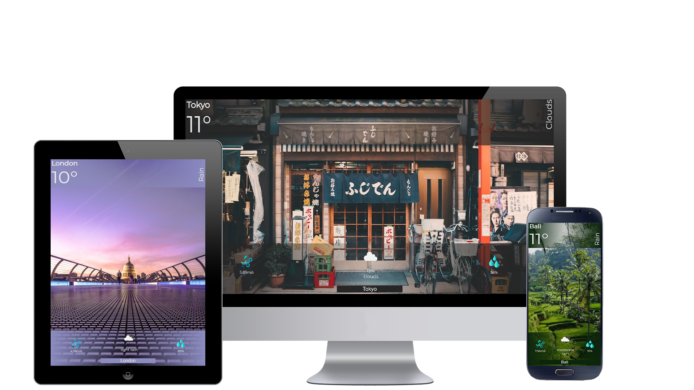

# weather-app

## What is this page about?

"You have been sent abroad for a 10-month work mission. Your family and friends back home ask you about the weather where you live ALL. THE. TIME.
Enough is enough, you decide to build a small web application for them so that you can free your time to talk about more interesting topics."

You can look at a final preview here at [Weather App](https://loaw.github.io/weather-app/)

## Teck point
The technologies used for this project are the following: 
-  HTML = site structure
-  CSS / SCSS = appearance of the site
-  JavaScript = site behavior

## Learning objectives

- A typical HTTP flow: send asynchronous requests to a remote server and process the results
- DOM manipulation: changing the DOM based on the results of the HTTP requests
- Learn to aggregate and parse data fetched from an api