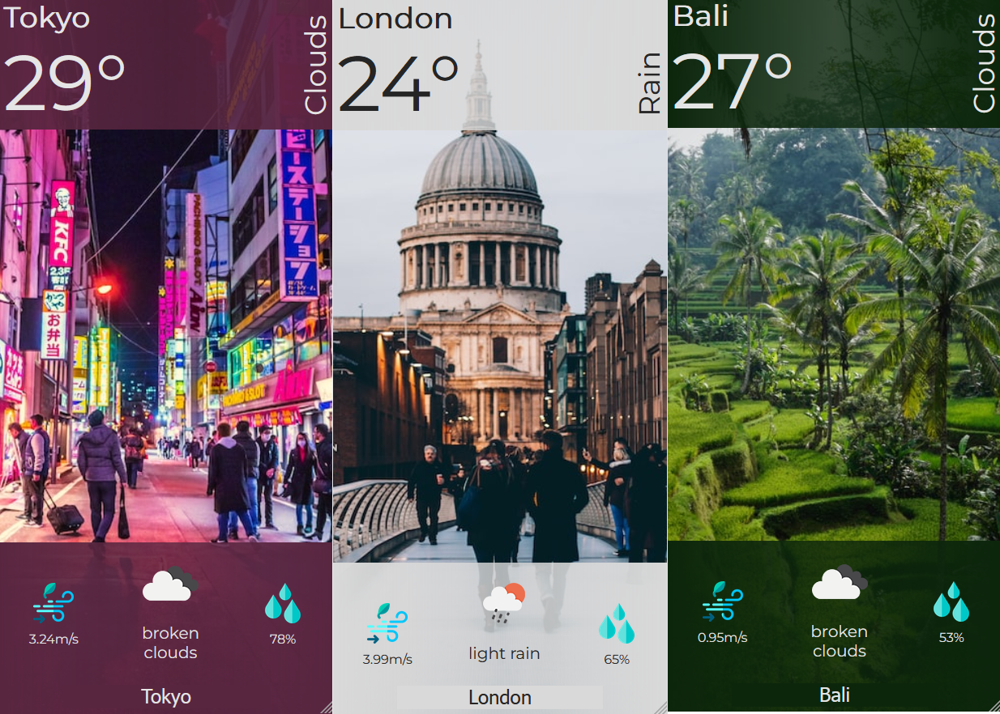
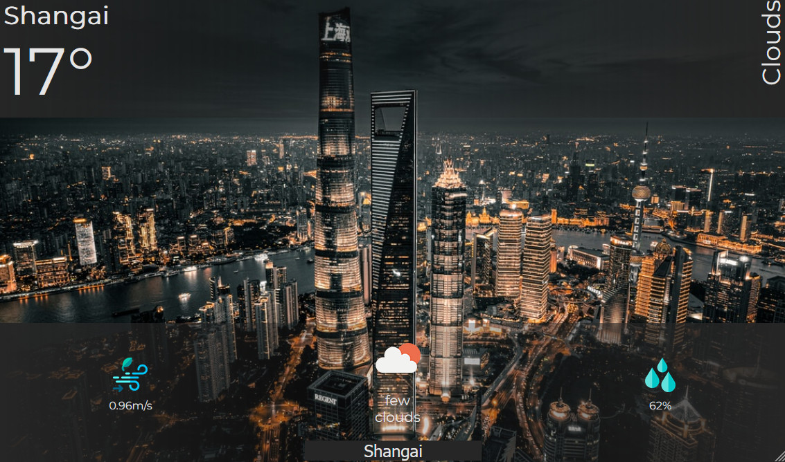

# weather-app

## Mission objectives

In this challenge you will use and consolidate your knowledge on:

-   A typical HTTP flow: send asynchronous requests to a remote server and process the results
-   DOM manipulation: changing the DOM based on the results of the HTTP requests
-   Learn to aggregate and parse data fetched from an api

## The Mission

You have been sent abroad for a 10-month work mission. Your family and friends back home ask you about the weather where you live ALL. THE. TIME.  
Enough is enough, you decide to build a small web application for them so that you can free your time to talk about more interesting topics.

### Specifications

#### 🌱 Must haves

-   In the home page the user can enter the city of their choice (think of the right HTML elements here)
-   On clicking the SUBMIT button or pressing ENTER the application will display the weather for the next 5 days

> 💡 Not sure where to start? Split this features into multiple smaller todos (in your code, sketch, ...)

#### 🌼 Nice to haves (in no specific order)

-   Remember the user choice on subsequent visits
-   Allow the user to compare the weather in multiple cities simultaneously
-   Use the API of https://unsplash.com/ to show a photo of the city they entered in the form.
-   Display a line graph of temperature over time using a library such as [Chart.js](https://www.chartjs.org)

### Instructions

-   Create an account on [OpenWeather](https://home.openweathermap.org/), and generate a key
-   Get the weather data using the native JS [`fetch()`](https://devdocs.io/dom/fetch_api/using_fetch) method.